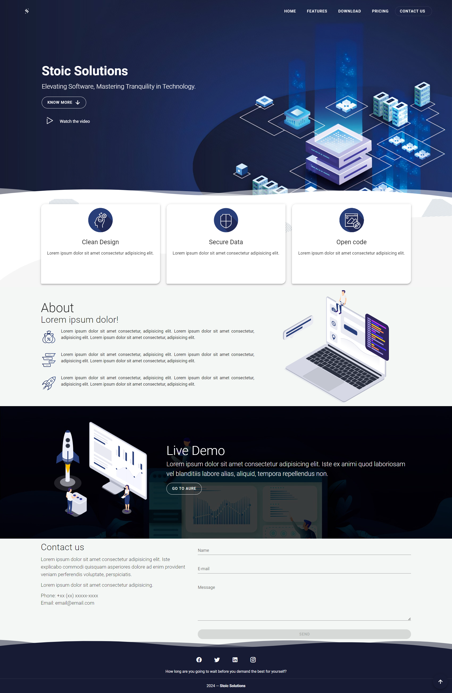

# Vuetify Landing Page Template

#### This is an example of a landing page built with vue and vuetify.

## 🚀 Project setup

Use [git](https://git-scm.com/) to clone the project.

```bash
git clone https://github.com/anmspro/stoic-solutions-landing-website.git
```

Enter the project.

```bash
cd vuetify-landing-page
```

Use [npm](https://www.npmjs.com/) to install dependencies.

```bash
npm i
```

## ☄️ Usage

Compiles and hot-reloads for development

```bash
npm run serve
```

Compiles and minifies for production

```bash
npm run build
```



### 🛠️ Technologies

The following tools were used in the construction of the project:

- [Vue.js](https://vuejs.org/)
- [Vuetify.js](https://vuetifyjs.com/)
- [Firebase](https://firebase.google.com/)

## ⚖️ Contributing

Pull requests are welcome. For major changes, please open an issue first to discuss what you would like to change.

Please make sure to update tests as appropriate.

## 👷‍♂️ Author

<a href="https://github.com/anmspro">
 
 <br />
 <sub><b>Abu Noman Md Sakib</b></sub></a> <a href="https://github.com/anmspro" title="Github">🚀</a>

## 🔑 License

[MIT](https://github.com/anmspro/stoic-solutions-landing-website/blob/master/LICENSE)
